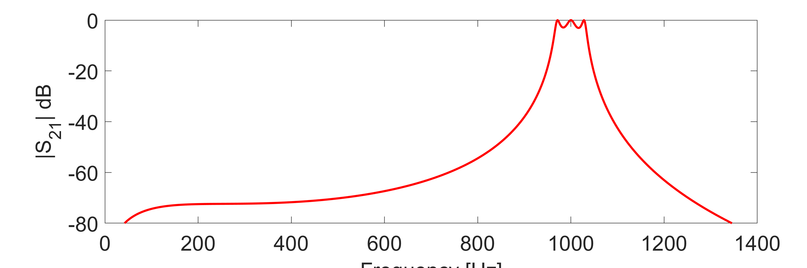

# Tunable Filter with varactors
## Idea (our goal)
The idea of this project is the design of a tunable filter with variable resonance frequency. Achieving this would be possible using varactors. The varactors are used in place of the capacitors in resonators thanks to their abrupt juction that results in an high variation in capacitance with respect to the voltage applied across their terminals. So the varactor is the tuning component in this project. The use of this component will be explained in the following notes.

## Design specifications
The (approximate) design specifications used in the design of this filter are the following:
- ***Type of Filter:*** band-pass
- ***Type of Response:*** Chebyshev (equi-ripple)
- ***Order of the filter:*** Third Order
- ***Resonant frequency:***  (adjustable)
- ***Bandwitdh:***  (adjustable)
- ***Ports Impedances:*** 
- ***Ripple Level:***  (adjustable)

## Design of the ideal Filter
The project started with the design of the ideal pass-band filter in order to verify that all the specifications can be satisfied. For the design, the method used was ***Insertion Loss Method*** taking the low-pass Filter prototype and changing the series and shunt components in order to have a pass-band response. Below is the schematic of the ideal pass-band filter:

Formulas used in the first design stage:
- 
- 
- 
- 
- 
- 

where:
-  : band-pass prototype filter coefficients, calculate as a third order Chebyshev filter [unitless]
-  : fractional bandwidth [%]
-  : angular frequency [rad/s]

The above formulas take into account impedance scaling and frequency scaling since the low-pass prototype uses an angular frequency at the resonant frequency of  and a source impedance of .
The resonant frequency (hence the fractional bandwidth) is not specified at this point of the design, instead it's left as a parameter. Then simulation environment's tuner tool (AWR) allows sweeping the parameter in its range.

In order to set an arbitrary inductor value for the resonators, impedance inverters were used with a proper value of ***K*** (inverter parameter). The resonator inductor value is called  in the schematic and its value is not yet determined, it's again a tunable value in order to obtain the best value which can be found as an off-the-shelf component. Thus, in the schematic of the pass-band filter, 4 impedance inverters were added, as shown in the following image:

The resonator capacitor value is set by the equation:

The above equation gives the proper value of  for the desired resonat frequency.

Following are the formulas used to compute ***K*** parameters for each inverter:
- K for the impedence inverter at the source: 
- K for the second impedence inverter: 
- K for the third impedence inverter: 
- K for the impedence inverter at the load: 

where  is the source impedance,  is the bandwidth expressed in terms of angular frequency,  is the desired resonator inductance, and  are the band-pass filter prototype coefficients.

At this point impedance inverters are implemented as quarter-wave long transmission lines. The range of working frequencies spans from 0 to 1 GHz, so the physical length of the transmission lines results in an unfeasible dimension for a printed circuit board. To minimize board dimensions, the most reasonable choice is to implement the filter with lumped elements only, so an equivalent circuit for impedance inverters is required. For the 2 impedance inverters in the middle of the filter, the equivalent circuit is a T circuit composed of three capacitors where the shunt capacitor has a positive capacitance while the serires capacitors have a negative capacitance. Capacitors with negative capacitance are not physically possible but the use of this component is useful in the theoric design phase. Negative capacitors will be "absorbed" by the series with resonator capacitors, but only if the negative capacitors have a capacitance (in magnitude) greater than the resonator's one.
However, negative capacitances of impedance inverters at source and load ports are not "absorbed". To solve this problem another equivalent circuit is required for those two special cases, it consists of a shunt positive capacitor and only one series negative capacitor.
The schematic where all the impedance inverters are replaced with their respective equivalent circuits is shown in the figure:

The formulas used to calculate capacitor values are:

- Impedance inverter at the source: 
	- shunt capacitor 
	- series capacitor 
- Second impedance inverter:
	- all capacitors have the same value 
- Third impedance inverter:
	- all capacitors have the same value 
- Impedance inverter at the load: 
	- shunt capacitor 
	- series capacitor 

Thanks to the symmetry of the circuit one has that  and .

As a last step of the design of the ideal pass-band filter, negative capacitors are "absorbed" by positive capacitors of the resonators. The final circuit is the following:

Capacitances are calculated using the well-known formula for series capacitance, thus:

- 
- 
- 

As per the circuit symmetry, .
It may be noted that the plus sign in front of  and  is due to the fact that the minus sign is inclued in their formulas.

Frequency response at the test resonant frequency of 1GHz of the final design of the ideal filter (without varactor) is shown below for ripple levels of 0.5 dB and 3dB respectively:

## Adding tunable element: the varactor