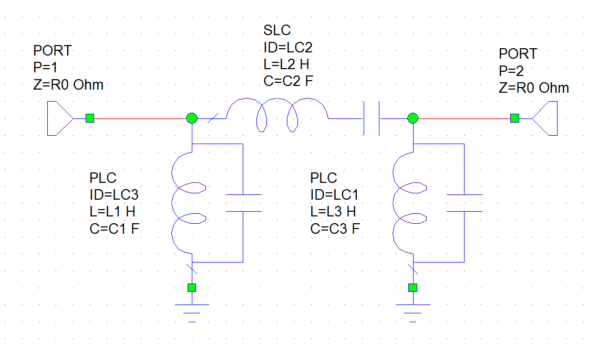
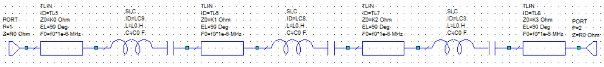
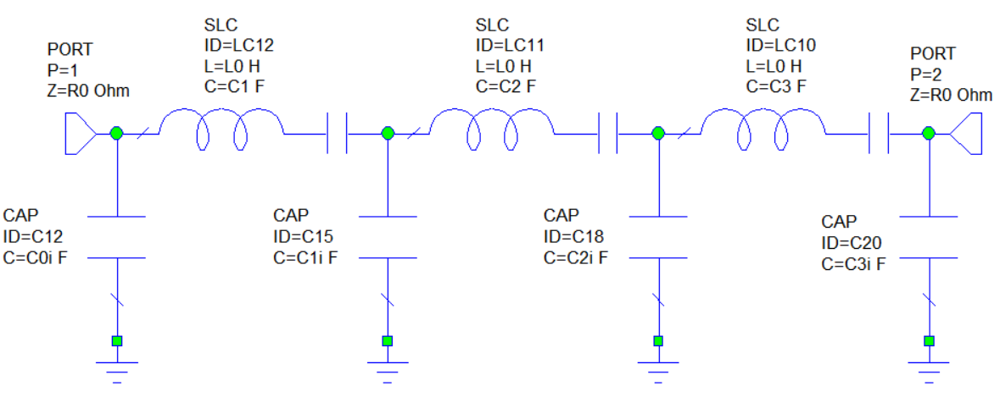

README.tex

# Tunable Filter with varactors
## Idea (our goal)
The idea of this project is to design a tunable filter in order to move the resonance frequency with the usage of varactors. The varactors are used in place of the capacitors in resonators thanks of the property to vary their capacitance as a function of the voltage applied across their terminals. So the varactor is the tuning component in this project. The use of this component will be explained in the following notes.

## Design specifications
The design specifications used in the design of this filter are the following:
- ***Type of Filter:*** band-pass
- ***Type of Response:*** Chebyshev (equi-ripple)
- ***Order of the filter:*** Third Order
- ***Resonant frequencies:***
    - $f_0$
    - $f_1$
    - $f_2$

- ***Bandwitdh:*** (constant for all resonant frequencies)
- ***Ports Impedances:*** $Z_0=50\Omega$
- ***Ripple Level:*** $Ar=0.5\,dB$

    
## Design of the ideal Filter
We started with the design of the ideal pass-band filter in order to verify that all the specifications can be satisfied. For the design we use the ***Insertion Loss Method*** taking the low-pass Filter prototype and changing the series and shunts components in order to have a pass-band response. The schematic of the ideal pass-band filter is the following:

These are the formulas used in our first design:
- $L1 = \frac{g_1 Z_0}{\Delta \omega_0}$
- $C1 = \frac{\Delta}{Z_0 g_1 \omega_0}$
- $L2 = \frac{\Delta Z_0}{\omega_0 g_2}$
- $C2 = \frac{g_2}{\Delta Z_0 \omega_0}$
- $L3 = \frac{g_3 Z_0}{\Delta \omega_0}$
- $C3 = \frac{\Delta}{Z_0 g_3 \omega_0}$

where:
- $g_m$ are the coefficients of the low-pass prototype filter for a third order Chebyshev filter 
- $\Delta$ is the fractional bandwidth at the chose resonant frequency
- $\omega_0$ is the angular frequency at the chosen resonant frequency

The written formulas take account of the impedence scaling and the frequency scaling since the low-pass prototype uses an angular frequency at the resonant frequency of $1 rad/sec$ and an impedence at the source of $Z_0=1 \Omega$.
The choice of the resonant frequency (hence the fractional bandwidth) is not specified at this point of the design because we use the tool tune of the simulator (AWR) to sweep resonant frequency in a chosen range of frequencies.

In order to set an inductor value for the resonators, we used impedance inverters with the proper value of ***K*** (inverter parameter). The inductor of the resonators is called $L_0$ in the schematic and its value is not yet specified because we use it as a tunable value in order to find the best value to satify our needs. Thus in the schematic of the pass-band filter we added 4 impedance inverters like shown in the following image:

The value of the capacitor of the resonators is set by the equation:

\begin{equation}
C_0 = \frac{1}{L_0 \omega_0^2}
\end{equation}

This equation allow us to have the proper value of $C_0$ for the wanted resonat frequency.

The formulas used to compute the values of the ***K*** parameter of each inverter are the following:
- K for the impedence inverter at the source: $K_0=\sqrt{\frac{R_0L_0BW}{g_0 g_1}}$
- K for the second impedence inverter: $K_1=\frac{BWL_0}{g_1g_2}$
- K for the third impedence inverter: $K_2=\frac{BWL_0}{g_2g_3}$
- K for the impedence inverter at the load: $K_3=\sqrt{\frac{R_0L_0BW}{g_3 g_4}}$

where $R_0$ is the source impedance (called $Z_0$ at the beginning), $BW$ is the bandwidth expressed in terms of angular frequency, $L_0$ is the chosen inductance for the resonators of the filter, and $g_i$ are the coefficients of the low-pass filter prototype.

At this point the impedance inverters are implemented by pieces of quarter-wavelength transmission lines. The range of working frequencies span from 0 to 1 GHz, so the physical length of the transmission lines results in a bigger board. To minimize the board dimensions we choose to implement the filter with only lumped elements, so an equivalent circuit for impedance inverters is required. For the 2 impedance inverters in the middle of the filter, the equivalent circuit is a T circuit formed by three capacitor where the shunt capacitor has a positive value of capacitance while the serires capacitors have a negative value of capacitance. Capacitors with negative capacitance are not physically possible but the use of this components are useful in the designing. Negative capacitors will be absorbed in the series with the capacitors of the resonators if the negative capacitors have absolute value capacitance greater than that of the resonator's capacitors.
For the impedance inverters at the source and at the load we have the problem that a negative capacitor is not absorbed. To solve this problem an other equivalent circuit is required for this two inverters impedance. This new equivalent circuit is used only for the inverter impedance at the source and at the load and it consists of a shunt positive capacitor and of a series negative capacitor.
The schematic where all the impedence inverters are replaced with their respective equivalent circuits is shown in the next figure:

The formulas used to calculate the values of the capacitors are:

- For the impedence inverter at the source: 
    - shunt capacitor $C_{0i} = \frac{\sqrt{1-\left(\frac{K_0}{R_0}\right)^2}}{K_0 \omega_0}$
    - series capacitor $C_{s0i}=-C_{0i}-\frac{1}{\left(R_0 \omega_0\right)^2 C_{0i}}$
- For the second impedence inverter:
    - all the capacitors have the same value $C_{1i} =\frac{1}{\omega_0 K_1}$
- For the second impedence inverter:
    - all the capacitors have the same value $C_{2i} =\frac{1}{\omega_0 K_2}$
- For the impedence inverter at the load: 
    - shunt capacitor $C_{3i} = \frac{\sqrt{1-\left(\frac{K_3}{R_0}\right)^2}}{K_3 \omega_0}$
    - series capacitor $C_{s3i}=-C_{3i}-\frac{1}{\left(R_0 \omega_0\right)^2 C_{3i}}$

For the symmetry of the circuit we have that $C_{s3i}=C_{s0i}$ and $C0i=C_{3i}$.

In the last step of the design of the idea pass-band filter the negative capacitors are absorbed by the positive capacitors of the resonators. The final circuit is the following:

The capacitance of the capacitors are calculated using the classical formulas of the equivalent capacitance of capacitors in series, thus:

- $C_1=\frac{1}{\frac{1}{C_0}+\frac{1}{C_{s0i}}-\frac{1}{C_{1i}}}$
- $C_2=\frac{1}{\frac{1}{C_0}-\frac{1}{C_{1i}}-\frac{1}{C_{2i}}}$
- $C_3=\frac{1}{\frac{1}{C_0}+\frac{1}{C_{s3i}}-\frac{1}{C_{2i}}}$

For the symmetry of the circuit, $C_1=C_3$.
We have to notice that the plus sign in front of $C_{s0i}$ and $C_{s3i}$ is due to the fact that the minus sign is inclued in their formulas.

The frequency response of the final design of the ideal filter (without varactor) is shown below for the ripple level of 0.5 dB and 3dB respectively:

## The tunable element: the varactor

